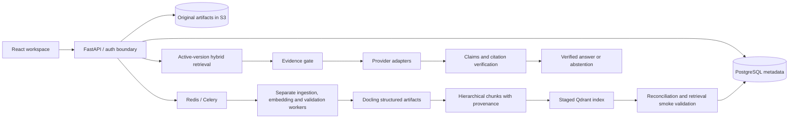

# System overview

## M1 implementation boundary

Implemented: authenticated tenant-scoped PDF upload, publication/version metadata, private immutable
originals, SHA-256 deduplication, idempotent durable jobs, guarded state/history, upload recovery,
transactional outbox and real Celery receipt. Library, document details and Operations use persisted
data. M0 health, typed settings, safe telemetry, provider abstractions and local infrastructure remain.

M2 added Docling parsing, provenance and parse-quality validation; M3 added structure-aware
hierarchical chunking with span-level provenance and chunk-quality validation; M4 added pinned
MedCPT dense embeddings, a versioned Qdrant index and verified index activation. Successful jobs
stop at READY_FOR_RETRIEVAL and all versions remain unsearchable. Ask is disabled. No query
retrieval, reranking or generation runs. Identity is a configured development bearer adapter;
production startup is rejected. This is not a production-ready medical system.

## Accepted target architecture

PostgreSQL will own activation manifests and authorization. Qdrant holds disposable search indexes;
S3 originals plus structured provenance permit rebuilding them. Queue delivery is at least once.
Workers must tolerate duplicate delivery. No distributed transaction is assumed between systems.

The backend separates API schemas, domain services, repository interfaces, ingestion, retrieval,
generation, evaluation and adapters. Empty packages reserve boundaries; they are not implementations.
Library/document and Operations job components now live in feature modules wired through
`frontend/src/App.tsx`. Ask remains safely disabled. Settings, Evaluations and Audit retain their
navigation shells; the admin audit API exists but a full audit UI is future work.

## Milestones

| Milestone | Deliverable |
|---|---|
| M0 | This architecture and tested environment foundation |
| M1 | Authorized upload, metadata, durable ingestion state and idempotent jobs |
| M2–M4 | Docling structure (done), provenance-aware chunks (done), staged embeddings and verified indexing (done) |
| M5–M6 | Evaluated hybrid retrieval, reranking and bounded expansion |
| M7–M8 | Evidence sufficiency, provider adapters, generation, verification and abstention |
| M9–M10 | Functional Ask, Library and versioned settings workflows |
| M11 | Full evaluation runner and reporting (fixtures begin in M0) |
| M12 | Production security, observability and deployment hardening |

Security constraints apply before the first data endpoint in M1; M12 does not defer authorization.
See the preserved [full requirements](../requirements/bootstrap.md) for acceptance criteria.
